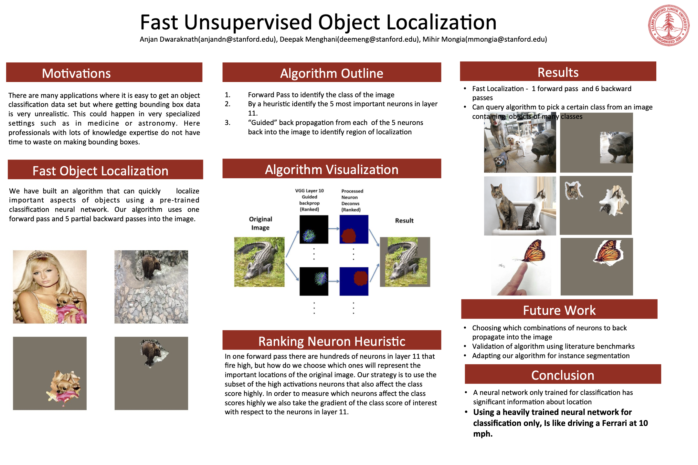

# Neural Interpretability: Fast Unsupervised Object Localization

An interpretability method that reads *where* an object is out of a network trained only to say
*what* it is. Using **only a pre-trained classification network** — no bounding-box labels, no
detection head, no extra training — one forward pass plus a handful of partial backward passes
produce a segmentation mask and a bounding box.

Course project for Stanford **CS231n: Convolutional Neural Networks for Visual Recognition**, by
Anjan Dwaraknath, Deepak Menghani, and Mihir Mongia.



*(Full-resolution poster: [`Poster.pdf`](Poster.pdf))*

---

## Goal

Getting image-level class labels is cheap; getting bounding boxes is not. In specialized domains —
medicine, astronomy — the people who could draw the boxes are exactly the people whose time you
cannot spend on drawing boxes.

The premise of this project: a network trained *only* to classify already knows where the object is.
That spatial information is latent in its convolutional activations, and it can be read out
directly. The goal is to extract it cheaply enough to be practical — and to make the readout
**queryable**, so that for an image containing several objects you can ask "where is the *pig*?"
rather than only "where is the most salient thing?".

## Approach

The algorithm runs on a pre-trained VGG-16 and works in three stages.

**1. Forward pass.** Run the image through VGG-16 and cache every intermediate activation. Either
take the arg-max class, or supply a class index yourself to query a specific object.

**2. Rank neurons in a mid-level conv layer (the "ranking neuron heuristic").** Hundreds of neurons
in conv block 11 fire strongly on any given image, and most of them are irrelevant to the object you
care about. Raw activation is not enough. Instead, we combine two signals:

- how strongly a neuron *fires* (its activation), and
- how much it *matters to the class of interest* — the gradient of that class's score with respect
  to the neuron, obtained by back-propagating from the class score down to layer 11.

The element-wise product `activation × gradient` is ranked, and we take the top `kmax` neurons,
keeping at most one neuron per filter so that the selection spans distinct features rather than
re-picking neighbouring positions in the same feature map.

**3. Guided back-propagation into pixel space.** Each selected neuron is back-propagated on its own,
all the way to the input, with negative gradients clamped to zero at every step (guided
backprop / deconv). The result is a sharp pixel-space map of what that single neuron responds to.
Each map is thresholded at a percentile and cleaned up morphologically (erode → dilate → convolve →
dilate → erode) into a compact **blob**.

**Scoring and combination.** Each blob is scored by masking the original image with it and measuring
the class score the network still assigns — a blob that preserves the class score is one that
actually contains the object. The top `n_neurons` blobs by score are unioned into the final mask,
and the bounding box is the tightest rectangle around that union, rescaled to the original image
dimensions.

Total cost: **1 forward pass + ~6 partial backward passes**, versus the region-proposal sweeps that
detection pipelines of the era relied on.

### Key entry points

| Function | File | What it does |
| --- | --- | --- |
| `bbox(im, model, layer, n_neurons, kmax, class_no)` | `library/localization.py` | Image → bounding box `(xmin, xmax, ymin, ymax)` |
| `get_localization_mask(...)` | `library/localization.py` | Image → binary segmentation mask |
| `visualize(im, bbox_coords)` | `library/localization.py` | Draw/apply the box on the original image |
| `eval_precision(box1, box2)` | `library/localization.py` | Intersection-over-Union between two boxes |
| `get_activs`, `deconv`, `get_backgrad` | `deconv_utils.py` | Forward caching, guided backprop, class-score gradients |
| `filter_of_intr`, `find_blob`, `get_score` | `deconv_utils.py` | Neuron ranking, blob extraction, masked-image scoring |
| `PretrainedVGG` | `library/classifiers/pretrained_vgg16.py` | NumPy VGG-16 with per-block `forward`/`backward` |

### Hyper-parameters

| Name | Default | Meaning |
| --- | --- | --- |
| `layer` | `11` | Conv block to read neurons from (0-indexed; the 12th of VGG-16's 13 conv layers) |
| `kmax` | `10` (`30` in the validation script) | How many top-ranked neurons to back-propagate and score |
| `n_neurons` | `5` | How many of the scored blobs to union into the final mask |
| `percentile_thresh` | `40` | Percentile threshold applied to each guided-backprop map |
| `Param.num_dilation` / `num_erosion` | `20` / `15` | Morphological clean-up of each blob |

## Results

- Localization from a classification-only network, at **1 forward + 6 backward passes** per image.
- The class can be *queried*: on an image containing a pig and a dog, asking for the pig class and
  asking for the dog class return different, correct regions (see the poster's Results panel).
- Validated on ImageNet images with ground-truth boxes, scored by IoU — see
  [Validation](#validation) below.

**Conclusion from the poster:** a network trained only for classification carries substantial
localization information. Using it for classification alone "is like driving a Ferrari at 10 mph."

**Future work:** choosing *combinations* of neurons to back-propagate jointly, validation against
standard literature benchmarks, and extending the mask output to instance segmentation.

---

## Setup

> **Note:** this is 2016-era code and targets **Python 2.7** with **OpenCV 2.x** (`cv2.cv`),
> `scipy.misc.imread`, and `urllib2`. It has not been ported to Python 3.

Dependencies: `numpy`, `scipy`, `matplotlib`, `h5py`, `cython`, `opencv` (Python 2 bindings),
plus Jupyter if you want the notebooks.

```bash
# 1. Build the Cython im2col extension used by the fast conv layers
cd library
python setup.py build_ext --inplace
cd ..

# 2. Download the pre-trained VGG-16 weights (vgg16_weights.h5)
#    https://drive.google.com/file/d/0Bz7KyqmuGsilT0J5dmRCM0ROVHc/view?usp=sharing
#    and place the file in Data/
```

After setup, `Data/` should contain `vgg16_weights.h5` (weights) and `CLASSES.pkl` (ImageNet class
index → name), both of which every entry point expects.

On macOS, the bundled `frameworkpython` wrapper runs the framework build of Python so that
matplotlib windows work from inside a virtualenv.

## How to run

### Single image

```python
import cv2, pickle
from library.classifiers.pretrained_vgg16 import PretrainedVGG
from library.localization import bbox, visualize

model = PretrainedVGG(h5_file='Data/vgg16_weights.h5')
CLASSES = pickle.load(open('Data/CLASSES.pkl'))

im = cv2.imread('Images/dog.jpg')          # BGR, original size — do not resize

# Unsupervised: the network picks the class itself
coords = bbox(im, model, layer=11, n_neurons=5, kmax=10)

# Or query a specific ImageNet class (338 = a particular animal class)
coords = bbox(im, model, class_no=338)

xmin, xmax, ymin, ymax = coords
visualize(im, coords)
```

To get the mask rather than the box, call `get_localization_mask(im, model, layer, n_neurons, kmax,
class_no)` — it returns the binary mask plus a cache of `(class_no, original_size)`.

### Notebooks

- **`Localization.ipynb`** — walks through the algorithm step by step: forward pass, neuron ranking,
  per-neuron deconv visualizations, blob extraction, mask union, and the final box. Start here to
  understand or tune the method.
- **`Validation.ipynb`** — the notebook form of the validation loop, plus the analysis of the
  results (IoU histograms, centre-correctness and rectangle-norm metrics, inspection of failures).

### Validation

`validation_script.py` runs the algorithm over a batch of ImageNet URLs with ground-truth boxes and
writes per-image IoU to CSV.

```bash
python validation_script.py Data/validation_1
```

The argument is the dataset path **without** the `.pkl` extension. Each `Data/validation_*.pkl` is a
pickled list of tuples:

```
(class_wnid, imgid, class_idx, xmlidx, url, xmin, xmax, ymin, ymax)
```

Results are written to `Data/results_k30_n5/<name>_results.csv` with columns:

```
index, imgid, class_idx, xmlidx, IoU, xmin, xmax, ymin, ymax, xmin_pred, xmax_pred, ymin_pred, ymax_pred
```

and a timestamped log to `<name>_log.txt` alongside it. The script is **resumable** — on restart it
reads the last index in the CSV and continues from there — and it skips images whose URL is dead or
that come back blank/white. Create the output directory before running; `kmax` and `n_neurons` are
set near the top of the script and are baked into the results directory name.

## Repository layout

```
deconv_utils.py                     Guided backprop, neuron ranking, blob extraction, scoring, image I/O
validation_script.py                Batch IoU validation over an ImageNet URL dataset
Localization.ipynb                  Step-by-step walkthrough of the algorithm
Validation.ipynb                    Validation loop + results analysis
Poster.pdf, docs/poster.png         CS231n project poster
library/
  localization.py                   Top-level bbox / mask / IoU API
  classifiers/pretrained_vgg16.py   NumPy VGG-16 with per-block forward & backward
  layers.py, fast_layers.py         Layer implementations (naive and im2col/Cython-backed)
  layer_utils.py, im2col*.pyx/.c    Layer composition and im2col kernels
  image_utils.py, data_utils.py     Image fetching and dataset helpers
  setup.py                          Builds the Cython extension
Data/                               validation_*.pkl datasets, CLASSES.pkl, (vgg16_weights.h5)
Images/                             Sample images
```

## Credits

The network plumbing (`layers.py`, `fast_layers.py`, `im2col*`, `pretrained_vgg16.py`, and other
helpers under `library/`) is derived from the assignment starter code for Stanford's
**CS231n: Convolutional Neural Networks for Visual Recognition**. The localization algorithm —
neuron ranking, guided backprop readout, blob scoring and combination, and the validation
pipeline — is this project's contribution.

The pre-trained VGG-16 weights originate from the VGG group's ImageNet model
(Simonyan & Zisserman, *Very Deep Convolutional Networks for Large-Scale Image Recognition*), and
the guided-backprop readout builds on Zeiler & Fergus (*Visualizing and Understanding Convolutional
Networks*) and Springenberg et al. (*Striving for Simplicity: The All Convolutional Net*).
